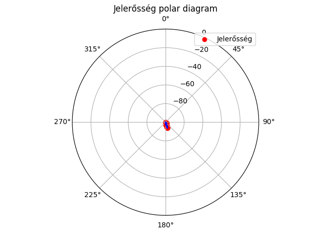

# GQRX Iránykarakterisztika Mérő

Ez a Python-alapú program lehetővé teszi rádiós jelerősség mérések végrehajtását egy körkörös szkenneléssel, a GQRX SDR vevő szoftver TCP/IP vezérlésén keresztül. A mért adatokból automatikusan polar (irány) diagramot készít, amely megmutatja az antenna vagy egy rádióforrás iránykarakterisztikáját.

## Funkciók

- GQRX vezérlése TCP/IP-n keresztül (frekvencia, moduláció, jelszint lekérdezés)
- Interaktív curses-alapú terminálfelület
- Mintavételezés több ponton, átlagolt jelszint számítással
- Automatikus adatmentés Excel-fájlba
- Polar diagram generálás matplotlib segítségével

## Telepítés

### Függőségek

Győződj meg róla, hogy a következő Python csomagok telepítve vannak:

```bash
pip install pandas matplotlib numpy openpyxl
```

Valamint szükséges a **GQRX** szoftver futtatása, engedélyezett **Remote Control (TCP)** modullal.

### Fájl letöltése

Töltsd le a Python scriptet (pl. `directional_meter.py`) és futtasd terminálból:

```bash
python directional_meter.py
```

## Használat

1. Add meg a mentési fájl nevét (pl. `meresek.xlsx`)
2. Állítsd be a frekvenciát Hz-ben (pl. `144390000`)
3. Add meg a minták számát mérésenként (pl. `5`)
4. Válassz modulációs módot (pl. `FM`)
5. Állítsd be a minimális és maximális jelszintet a polar diagram skálázásához (pl. `-100 0`)
6. A nyílbillentyűkkel állítsd be az irányt, majd Enter-rel mérj!
7. A `q` vagy `Q` lenyomásával kilépsz, és az adatok elmentődnek, a polar diagram automatikusan generálódik.

## Kimenet

- **Excel fájl** a mérésekről: időbélyeg, frekvencia, szög, jelerősség
- **Polar diagram** PNG formátumban (`signal_strength_polar.png`)

## Példa eredmény



## Fejlesztési irány: vezérelt tárgyasztal

A jövőben a rendszer kiegészülhet egy **motorosan vezérelt forgatóasztallal**, amely automatikusan végighalad a méréseken, és így teljesen automatizált iránykarakterisztika felmérést tesz lehetővé. A forgatást Raspberry Pi vagy Arduino alapú vezérlőmodul irányítaná.

## Licenc

MIT

## Készítette

Géptárs & [Te](https://github.com/yourusername)  
📡 Rádiós jövőképek – mérések, ábrák, iránytű a hullámok világában.

